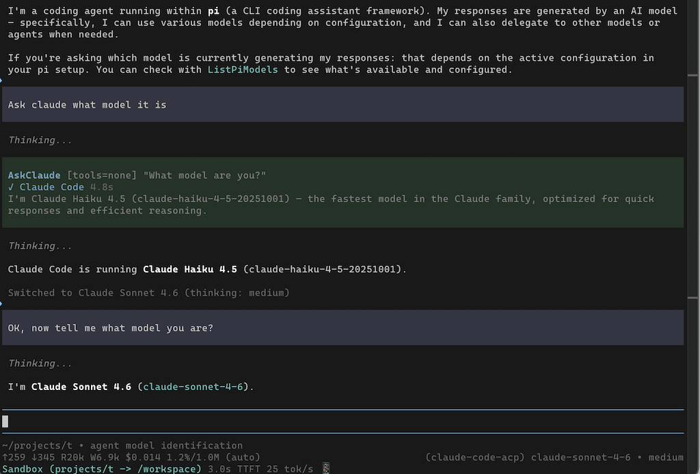

# pi-claude-code-acp



Pi extension that integrates Claude Code via ACP (Agent Client Protocol). Provides two ways to use Claude Code from pi:

1. **Provider** — Offers Opus/Sonnet/Haiku as models that can be selected in pi like usual
2. **AskClaude tool** — pi can use this to delegate tasks or ask questions of Claude Code without having to switch from another model/provider

Behind the scenes, it is automating a real Claude Code session and using MCP to bridge tool calls from Claude Code back to Pi where they are executed.

It a little janky, but actually mostly works! 

This is a heavily reworked fork of [claude-agent-sdk-pi](https://github.com/prateekmedia/claude-agent-sdk-pi), which does a similar thing using the Agent SDK. The advantage of ACP over the Agent SDK or pi's built-in Claude Code emulation is that (I believe) the ACP approach is a fully compliant way to use Claude Max/Pro subscription. It follows the rules: only the real Claude Code touches Anthropic's API and requests are part of a user-driven coding session.

(IANAL and obviously this extension is unofficial and neither endorsed nor supported by Anthropic.)

## Setup

1. Install:
   ```
   pi install npm:pi-claude-code-acp
   ```

2. Ensure Claude Code is installed and logged in (`claude` CLI works).

3. Reload pi: `/reload`

## Provider

Provider ID: `claude-code-acp`

Use `/model` to select:
- `claude-code-acp/claude-opus-4-6`
- `claude-code-acp/claude-sonnet-4-6`
- `claude-code-acp/claude-haiku-4-5`

Claude Code handles tool execution internally via ACP. Pi's tools are forwarded through an MCP bridge so Claude Code can call them. Built-in Claude Code tools are disabled in provider mode — all tool calls go through pi.

## AskClaude Tool

Available when using any non-claude-code-acp provider. Pi's LLM can delegate to Claude Code for second opinions, analysis, or autonomous tasks.

**Parameters:**
- `prompt` — the question or task (include relevant context — Claude Code has no conversation history)
- `mode` — tool access preset:
  - `"full"` (default): read, write, run commands — for tasks that need changes
  - `"read"`: read-only codebase access — for review, analysis, research
  - `"none"`: no tools, reasoning only — for general questions, brainstorming

Claude Code's tools are currently auto-approved (bypass permissions mode) — it can read, write, and run commands without user confirmation. The `mode` parameter is the primary control over what Claude Code can do. This may change in future versions to support more granular permission control. Pre-existing MCP servers from user/project config are suppressed via `--strict-mcp-config`. Pi's skills are forwarded to Claude Code's system prompt so it has the same skill awareness as pi.

## Configuration

Config files: `~/.pi/agent/claude-code-acp.json` (global) and `.pi/claude-code-acp.json` (project overrides global).

```json
{
  "askClaude": {
    "enabled": true,
    "name": "AskClaude",
    "label": "Ask Claude Code",
    "description": "Custom tool description override",
    "defaultMode": "full",
    "appendSkills": true
  }
}
```

- `"enabled": false` — disable the AskClaude tool
- `"appendSkills": false` — don't forward pi's skills to Claude Code

## Limitations

**AskClaude has no shared conversation history.** Each call creates a fresh Claude Code session. The calling LLM must pack relevant context into the prompt string. Persistent sessions are planned (see TODOs).

**Claude Code loads its own skills** from `~/.claude/skills/` and `.claude/skills/` in addition to the pi skills we forward. These are additive — Claude Code may have skills pi doesn't know about.

**Provider context awkward when switching to claude-code-acp provider** When switching to claude-code-acp from another model provider during a session, only the last 20 messages are sent (includes tool results, so roughly 3-5 full exchanges). The messages are also crammed into the first user prompt since there's no way to insert messages into Claude Code's history.

See [docs/acp-meta-reference.md](docs/acp-meta-reference.md) for the full set of available ACP `_meta` options.

## TODOs

- **Markdown rendering** in expanded tool result view. Currently plain text — code blocks, headings, lists render as raw syntax. Use `Markdown` from `@mariozechner/pi-tui` with a `MarkdownTheme` built from pi's theme (see `buildMdTheme` in `extensions/claude-acp.ts`). Requires returning a `Box` instead of `Text` from `renderResult`.
- **Persistent AskClaude session**: reuse the same Claude Code session across calls so context accumulates (e.g., plan a feature → implement → review). Use `_meta.claudeCode.options.resume` to reconnect. Add `/claude:clear` to reset. Reset automatically on session fork/switch. Tradeoff: `allowedTools` is set at session creation and can't change per-call, so a persistent session would need to be created with `full` tools and rely on prompt-level instructions for mode restrictions. This is more concerning when AskClaude is auto-invoked (e.g., a skill that always delegates planning to Claude) rather than explicitly requested by the user — the user may not realize Claude Code has full tool access. Worth considering whether persistent sessions should default to `read` or require explicit opt-in.
- **`/claude:btw` command** for ephemeral questions (like Claude Code's own `/btw`): quick question, response displayed but not added to LLM context. Mode `read` by default. Two approaches for showing the full response:
  - **displayOnly message**: `sendMessage` with `display: true` + `displayOnly` detail, filtered from LLM context via `on("context")`. Proven pattern from `extensions/claude-acp.ts`.
  - **Overlay**: `ctx.ui.custom()` with `{ overlay: true }` for a dismissible panel.
  - Stream progress into a widget during execution, clear on next user input via `on("input")`.
